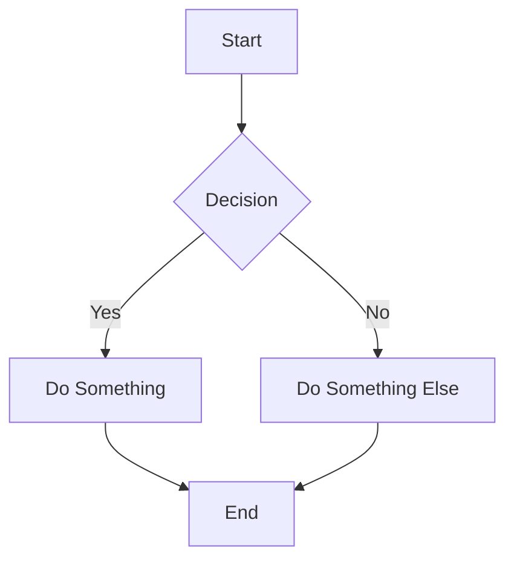
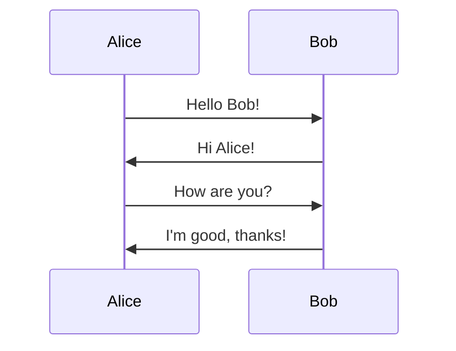
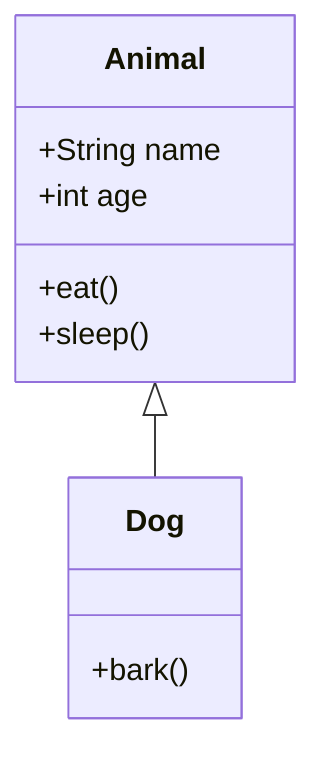
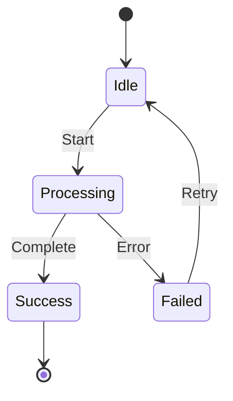
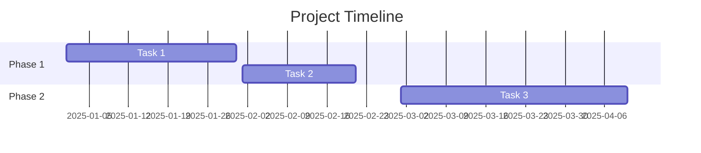

# Diagram Converter API - Copilot Agent Instructions

You have access to a diagram conversion service that can convert between different diagram formats.

## Service Endpoint

- **Local/Host**: `http://localhost:3000`
- **From devcontainer**: `http://diagram-converter:3000`
- **From Docker network**: `http://diagram-converter:3000`

## Available Endpoints

### 1. Convert Mermaid to PNG

Converts Mermaid diagram code to PNG image.

```bash
curl -X POST http://diagram-converter:3000/convert/mermaid2png \
  -H "Content-Type: text/plain" \
  --data-binary @diagram.mmd \
  -o output.png
```

**Or with inline code:**
```bash
echo "graph TD; A-->B; B-->C" | \
  curl -X POST http://diagram-converter:3000/convert/mermaid2png \
  -H "Content-Type: text/plain" \
  --data-binary @- \
  -o diagram.png
```

### 2. Convert Mermaid to SVG

Converts Mermaid diagram code to SVG vector graphics.

```bash
curl -X POST http://diagram-converter:3000/convert/mermaid2svg \
  -H "Content-Type: text/plain" \
  --data-binary @diagram.mmd \
  -o output.svg
```

**Or with inline code:**
```bash
echo "graph LR; A[Start]-->B[End]" | \
  curl -X POST http://diagram-converter:3000/convert/mermaid2svg \
  -H "Content-Type: text/plain" \
  --data-binary @- \
  -o diagram.svg
```

### 3. Convert SVG to PNG

Converts SVG file to PNG image with optional DPI setting.

```bash
curl -X POST http://diagram-converter:3000/convert/svg2png \
  -F "file=@diagram.svg" \
  -F "density=300" \
  -o output.png
```

**Default density**: 300 DPI  
**Range**: 1-1200 DPI

### 4. Convert Mermaid File to PNG

Upload a .mmd file and convert to PNG.

```bash
curl -X POST http://diagram-converter:3000/convert/mermaid-file \
  -F "file=@diagram.mmd" \
  -o output.png
```

### 5. Health Check

Check if the service is running.

```bash
curl http://diagram-converter:3000/health
```

**Response:**
```json
{
  "status": "ok",
  "service": "diagram-converter",
  "version": "1.0.0",
  "endpoints": {
    "POST /convert/svg2png": "Convert SVG file to PNG",
    "POST /convert/mermaid2png": "Convert Mermaid code to PNG",
    "POST /convert/mermaid2svg": "Convert Mermaid code to SVG",
    "POST /convert/mermaid-file": "Convert Mermaid file to PNG",
    "GET /agent": "Get VS Code agent definition"
  },
  "uptime": 123.45,
  "timestamp": "2025-11-17T12:00:00.000Z"
}
```

## Mermaid Diagram Examples

### Flowchart


### Sequence Diagram


### Class Diagram


### State Diagram


### Gantt Chart


## Common Workflows

### Workflow 1: Extract and Convert Mermaid from Markdown

When you encounter Mermaid diagrams in Markdown files:

1. Extract the Mermaid code blocks (between \`\`\`mermaid and \`\`\`)
2. Save to .mmd files or convert directly
3. Generate PNG or SVG
4. Update Markdown to reference the image

**Example:**
```bash
# Extract from markdown
grep -A 20 '```mermaid' doc.md | sed '1d;$d' > diagram.mmd

# Convert to PNG
curl -X POST http://diagram-converter:3000/convert/mermaid2png \
  -H "Content-Type: text/plain" \
  --data-binary @diagram.mmd \
  -o diagram.png
```

### Workflow 2: Batch Convert Multiple Diagrams

```bash
# Find all .mmd files and convert to PNG
for file in diagrams/*.mmd; do
  basename="${file%.mmd}"
  curl -X POST http://diagram-converter:3000/convert/mermaid2png \
    -H "Content-Type: text/plain" \
    --data-binary @"$file" \
    -o "${basename}.png"
  echo "✅ Converted: $file → ${basename}.png"
done
```

### Workflow 3: Convert SVG to High-Resolution PNG

```bash
# Convert with high DPI for print quality
curl -X POST http://diagram-converter:3000/convert/svg2png \
  -F "file=@diagram.svg" \
  -F "density=600" \
  -o diagram-hires.png
```

## Error Handling

The service returns appropriate HTTP status codes:

- **200 OK**: Conversion successful
- **400 Bad Request**: Invalid input (missing code, invalid format)
- **500 Internal Server Error**: Conversion failed

**Example error response:**
```json
{
  "error": "Mermaid CLI failed: syntax error at line 3"
}
```

## Best Practices

1. **Always check service availability first**
   ```bash
   curl http://diagram-converter:3000/health
   ```

2. **Use appropriate format for output**
   - PNG for raster images (documentation, presentations)
   - SVG for vector graphics (web, scalable displays)

3. **Set proper DPI for PNG conversions**
   - 72-96 DPI: Web/screen display
   - 150 DPI: Standard print
   - 300 DPI: High-quality print
   - 600+ DPI: Professional print

4. **Clean up temporary files**
   ```bash
   rm -f /tmp/diagram-*.mmd /tmp/diagram-*.png
   ```

5. **Validate Mermaid syntax before converting**
   - Test at https://mermaid.live
   - Check for proper indentation
   - Verify all brackets/quotes are balanced

## Troubleshooting

### Service not responding
```bash
# Check if container is running
docker ps | grep diagram-converter

# Restart if needed
docker restart diagram-converter

# Check logs
docker logs diagram-converter
```

### Conversion fails
1. Verify Mermaid syntax is valid
2. Check file encoding is UTF-8
3. Ensure no special characters in filenames
4. Review error message for specific issues

### PNG quality issues
- Increase density parameter for higher resolution
- Use SVG format for scalable output
- Check source diagram complexity

## Integration Examples

### With Confluence MCP

The Confluence MCP server automatically uses this service to convert Mermaid diagrams when creating pages:

```javascript
// Confluence MCP handles this automatically
confluence_create_page({
  title: "Architecture Diagram",
  markdownContent: `
# System Architecture

\`\`\`mermaid
graph TD
    A[Client] --> B[API]
    B --> C[Database]
\`\`\`
  `
})
// Mermaid is auto-converted to PNG and uploaded as attachment
```

### With GitHub Actions

```yaml
- name: Convert diagrams
  run: |
    for mmd in docs/diagrams/*.mmd; do
      curl -X POST http://localhost:3000/convert/mermaid2png \
        -H "Content-Type: text/plain" \
        --data-binary @"$mmd" \
        -o "${mmd%.mmd}.png"
    done
```

### With Node.js

```javascript
const fetch = require('node-fetch');
const fs = require('fs');

async function convertMermaidToPng(mermaidCode, outputFile) {
  const response = await fetch('http://diagram-converter:3000/convert/mermaid2png', {
    method: 'POST',
    headers: { 'Content-Type': 'text/plain' },
    body: mermaidCode
  });
  
  if (!response.ok) {
    throw new Error(`Conversion failed: ${response.statusText}`);
  }
  
  const buffer = await response.buffer();
  fs.writeFileSync(outputFile, buffer);
}

// Usage
const mermaid = 'graph TD; A-->B; B-->C';
await convertMermaidToPng(mermaid, 'diagram.png');
```

### With Python

```python
import requests

def convert_mermaid_to_svg(mermaid_code, output_file):
    url = 'http://diagram-converter:3000/convert/mermaid2svg'
    response = requests.post(
        url,
        data=mermaid_code.encode('utf-8'),
        headers={'Content-Type': 'text/plain'}
    )
    
    if response.status_code == 200:
        with open(output_file, 'wb') as f:
            f.write(response.content)
        return True
    else:
        print(f"Error: {response.json()}")
        return False

# Usage
mermaid = """
graph LR
    A[Python] --> B[API]
    B --> C[SVG]
"""
convert_mermaid_to_svg(mermaid, 'diagram.svg')
```

## Service Information

- **Technology**: Node.js + Mermaid CLI + ImageMagick
- **Container**: Alpine Linux
- **Mermaid Version**: Latest @mermaid-js/mermaid-cli
- **Port**: 3000
- **Health endpoint**: `/health`
- **Max file size**: Default Node.js limits (can be configured)
- **Supported formats**: 
  - Input: Mermaid code, SVG files
  - Output: PNG, SVG

## Quick Reference

| Endpoint | Input | Output | Use Case |
|----------|-------|--------|----------|
| `/convert/mermaid2png` | Mermaid code (text/plain) | PNG | Documentation images |
| `/convert/mermaid2svg` | Mermaid code (text/plain) | SVG | Web graphics, scalable |
| `/convert/svg2png` | SVG file (multipart) | PNG | Convert vector to raster |
| `/convert/mermaid-file` | .mmd file (multipart) | PNG | Batch processing |
| `/health` | - | JSON | Service status |

---

**Start using the service:**
```bash
# Test health
curl http://diagram-converter:3000/health

# Quick test conversion
echo "graph TD; A-->B" | \
  curl -X POST http://diagram-converter:3000/convert/mermaid2svg \
  -H "Content-Type: text/plain" \
  --data-binary @- \
  -o test.svg
```
