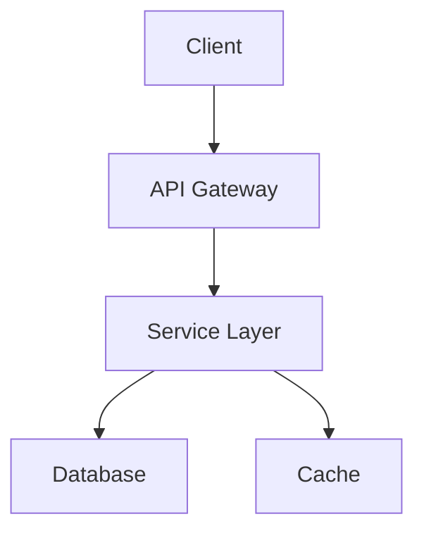
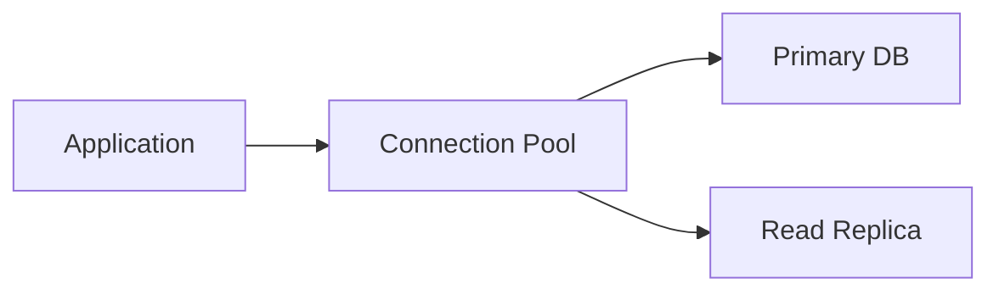

# Complete Workflow Example: Documentation Pipeline

This example demonstrates a complete documentation workflow using all three utility containers:
- **diagram-converter**: Convert diagrams to images
- **pandoc-mcp**: Convert document formats
- **confluence-mcp**: Publish to Confluence

## Scenario

You're creating technical documentation that includes:
- Markdown content
- Mermaid diagrams
- Need to publish to Confluence
- Also want PDF version for offline distribution

## Prerequisites

```bash
# Start all services
docker compose up -d

# Verify all services are healthy
curl http://localhost:3000/health  # diagram-converter
curl http://localhost:3001/health  # confluence-mcp
curl http://localhost:3002/health  # pandoc-mcp

# All should return {"status": "healthy"}
```

## Step-by-Step Workflow

### 1. Create Documentation with Diagrams

Create `workspace/docs/architecture.md`:

```markdown
# System Architecture

## Overview

Our system consists of three main components:



## Component Details

### API Gateway
The API Gateway handles all incoming requests...

### Service Layer
The Service Layer processes business logic...

### Database
We use PostgreSQL for data persistence...



## Deployment

Our deployment process...
```

### 2. Convert Diagrams to PNG

**Ask AI (via diagram-converter):**
```
"Convert all Mermaid diagrams in workspace/docs/architecture.md to PNG 
and save them in workspace/diagrams/"
```

**What happens:**
1. AI finds Mermaid code blocks
2. Extracts each diagram
3. Calls diagram-converter service
4. Saves as PNG files:
   - `workspace/diagrams/architecture-diagram-1.png`
   - `workspace/diagrams/architecture-diagram-2.png`

### 3. Update Markdown with Image References

**Ask AI:**
```
"Update workspace/docs/architecture.md to reference the converted PNG diagrams"
```

**Result:**
```markdown
# System Architecture

## Overview

Our system consists of three main components:


## Component Details
...


## Deployment
...
```

### 4. Publish to Confluence

**Ask AI (via confluence-mcp):**
```
"Publish workspace/docs/architecture.md to Confluence in the 
Engineering space under the Architecture page"
```

**What happens:**
1. AI reads the markdown file
2. Uploads diagram images to Confluence
3. Converts markdown to Confluence storage format
4. Creates or updates the page
5. Returns the Confluence page URL

### 5. Generate PDF Version

**Ask AI (via pandoc-mcp):**
```
"Convert workspace/docs/architecture.md to PDF with table of contents 
and numbered sections"
```

**What happens:**
1. AI calls pandoc_convert_file with:
   ```json
   {
     "inputPath": "workspace/docs/architecture.md",
     "outputPath": "workspace/output/architecture.pdf",
     "standalone": true,
     "toc": true,
     "numberSections": true
   }
   ```
2. Pandoc generates professional PDF with embedded images
3. File saved to `workspace/output/architecture.pdf`

Note: Requires Dockerfile.full for PDF support.

## Alternative: Single AI Command

You can also do the entire workflow with one prompt:

```
"Take the documentation in workspace/docs/architecture.md, 
convert the Mermaid diagrams to PNG, update the markdown 
to reference the images, publish to Confluence Engineering 
space, and create a PDF version with TOC"
```

The AI will orchestrate all services:
1. diagram-converter → Convert diagrams
2. Edit markdown → Update image references
3. confluence-mcp → Publish to Confluence
4. pandoc-mcp → Generate PDF

## Automation Script

For repetitive workflows, create a script:

**`workspace/scripts/publish-docs.sh`:**
```bash
#!/bin/bash
# Automated documentation publishing

set -e

DOC_FILE="$1"
CONFLUENCE_SPACE="$2"
CONFLUENCE_PARENT="$3"

if [ -z "$DOC_FILE" ]; then
    echo "Usage: $0 <markdown-file> <confluence-space> [parent-page]"
    exit 1
fi

echo "📄 Processing $DOC_FILE..."

# 1. Convert diagrams
echo "🎨 Converting diagrams..."
# Call diagram-converter API or use AI

# 2. Generate PDF
echo "📑 Generating PDF..."
BASENAME=$(basename "$DOC_FILE" .md)
curl -X POST http://localhost:3002/convert \
  -F "inputPath=$DOC_FILE" \
  -F "outputPath=workspace/output/${BASENAME}.pdf" \
  -F "standalone=true" \
  -F "toc=true"

# 3. Publish to Confluence
echo "☁️  Publishing to Confluence..."
# Call confluence-mcp API or use AI

echo "✅ Done!"
echo "   PDF: workspace/output/${BASENAME}.pdf"
echo "   Confluence: ${CONFLUENCE_SPACE}"
```

Usage:
```bash
./workspace/scripts/publish-docs.sh \
  workspace/docs/architecture.md \
  Engineering \
  "Technical Documentation"
```

## CI/CD Integration

**`.github/workflows/publish-docs.yml`:**
```yaml
name: Publish Documentation

on:
  push:
    paths:
      - 'workspace/docs/**'

jobs:
  publish:
    runs-on: ubuntu-latest
    
    steps:
      - uses: actions/checkout@v2
      
      - name: Setup Docker Network
        run: docker network create dev-network
      
      - name: Start Utility Containers
        run: |
          docker compose up -d
          sleep 10  # Wait for services
      
      - name: Process Diagrams
        run: |
          # Convert Mermaid diagrams
          for file in workspace/docs/**/*.md; do
            echo "Processing diagrams in $file"
            # Call diagram-converter
          done
      
      - name: Publish to Confluence
        env:
          MCP_API_KEY: ${{ secrets.MCP_API_KEY }}
          CONFLUENCE_TOKEN: ${{ secrets.CONFLUENCE_TOKEN }}
        run: |
          # Publish updated docs
          # Call confluence-mcp
      
      - name: Generate PDFs
        run: |
          mkdir -p output
          for file in workspace/docs/**/*.md; do
            basename=$(basename "$file" .md)
            docker exec pandoc-mcp \
              pandoc "/workspace/docs/$basename.md" \
              -o "/workspace/output/$basename.pdf" \
              --standalone --toc
          done
      
      - name: Upload PDFs
        uses: actions/upload-artifact@v2
        with:
          name: documentation-pdfs
          path: workspace/output/*.pdf
```

## DevContainer Integration

**`.devcontainer/devcontainer.json`:**
```json
{
  "name": "Documentation Project",
  "features": {
    "ghcr.io/devcontainers/features/docker-outside-of-docker:1": {}
  },
  "runArgs": ["--network=dev-network"],
  "containerEnv": {
    "MCP_API_KEY": "${localEnv:MCP_API_KEY}"
  },
  "customizations": {
    "vscode": {
      "settings": {
        "mcp": {
          "servers": {
            "diagram-converter": {
              "url": "http://diagram-converter:3000",
              "description": "Diagram Converter"
            },
            "confluence": {
              "url": "http://confluence-mcp:3001/mcp",
              "transport": { "type": "sse" },
              "headers": { "x-mcp-api-key": "${env:MCP_API_KEY}" },
              "description": "Confluence MCP"
            },
            "pandoc": {
              "url": "http://pandoc-mcp:3002/mcp",
              "transport": { "type": "sse" },
              "headers": { "x-mcp-api-key": "${env:MCP_API_KEY}" },
              "description": "Pandoc MCP"
            }
          }
        }
      }
    }
  },
  "postCreateCommand": "bash .devcontainer/fetch-agents.sh"
}
```

**`.devcontainer/fetch-agents.sh`:**
```bash
#!/bin/bash
# Fetch agent definitions from utility containers

mkdir -p .vscode

echo "📥 Fetching agent definitions..."

curl http://diagram-converter:3000/agent > .vscode/diagram-converter.agent.md
curl http://confluence-mcp:3001/agent > .vscode/confluence-publisher.agent.md
curl http://pandoc-mcp:3002/agent > .vscode/pandoc-converter.agent.md

echo "✅ Agent definitions fetched!"
echo ""
echo "Available agents:"
echo "  @diagram-converter - Convert diagrams"
echo "  @confluence-publisher - Publish to Confluence"
echo "  @pandoc-converter - Convert documents"
```

## Project Structure

```
my-documentation-project/
├── .devcontainer/
│   ├── devcontainer.json
│   └── fetch-agents.sh
├── .github/
│   └── workflows/
│       └── publish-docs.yml
├── workspace/
│   ├── docs/
│   │   ├── architecture.md
│   │   ├── api-guide.md
│   │   └── deployment.md
│   ├── diagrams/
│   │   ├── architecture-1.png
│   │   └── architecture-2.png
│   ├── output/
│   │   └── architecture.pdf
│   └── scripts/
│       └── publish-docs.sh
├── .env
└── docker-compose.yml
```

## Benefits of This Workflow

✅ **Automated** - Convert diagrams, publish docs, generate PDFs  
✅ **Consistent** - Same process every time  
✅ **Efficient** - AI handles orchestration  
✅ **Reproducible** - CI/CD integration  
✅ **Flexible** - Works locally and in devcontainers  
✅ **Collaborative** - Team members use same tools

## Monitoring and Logs

```bash
# Watch all service logs
docker compose logs -f

# Individual service logs
docker compose logs diagram-converter
docker compose logs confluence-mcp
docker compose logs pandoc-mcp

# Check service status
docker compose ps

# View resource usage
docker stats
```

## Troubleshooting

### Diagram Conversion Fails

```bash
# Check diagram-converter health
curl http://localhost:3000/health

# View logs
docker compose logs diagram-converter

# Test manually
curl -X POST http://localhost:3000/convert/mermaid2png \
  -H "Content-Type: text/plain" \
  --data-binary "@diagram.mmd"
```

### Confluence Publishing Fails

```bash
# Test connection
curl -X POST http://localhost:3001/mcp/test-connection

# Check credentials in .env
cat .env | grep CONFLUENCE

# View logs
docker compose logs confluence-mcp
```

### PDF Generation Fails

```bash
# Verify pandoc-mcp is running
curl http://localhost:3002/health

# Check if using Dockerfile.full
docker inspect pandoc-mcp | grep -i dockerfile

# Test pandoc directly
docker exec pandoc-mcp pandoc --version
```

## Summary

This complete workflow demonstrates:
1. **Integration** of all three utility containers
2. **Automation** via AI orchestration
3. **Flexibility** for different output formats
4. **Reproducibility** through CI/CD
5. **Developer Experience** with VS Code and devcontainers

The combination of diagram-converter, pandoc-mcp, and confluence-mcp creates a powerful documentation pipeline suitable for technical teams.
