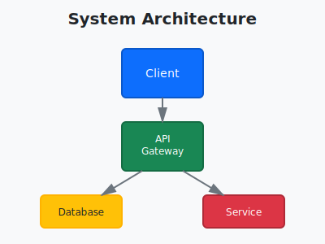

# Example Documentation

This is an example markdown document that demonstrates diagram integration.

## System Architecture

Our system architecture is shown below:



## Process Flow

The main process flow uses a Mermaid diagram:


## Features

- ✅ Automatic diagram conversion
- ✅ SVG to PNG conversion
- ✅ Mermaid to PNG conversion
- ✅ Confluence publishing support

## Usage

To process this document:

```bash
# Convert all diagrams
./scripts/process-markdown.sh workspace/docs/example.md

# This will create: workspace/docs/example_processed.md
```

## Next Steps

1. Add your own diagrams to `workspace/diagrams/`
2. Reference them in your markdown files
3. Process with the conversion script
4. Publish to Confluence using MCP

## Notes

- SVG files should be valid SVG format
- Mermaid files should use standard Mermaid syntax
- Output PNGs will have the same name as the source files
